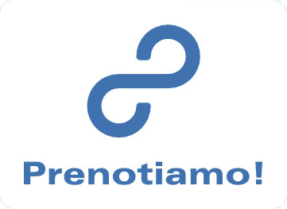
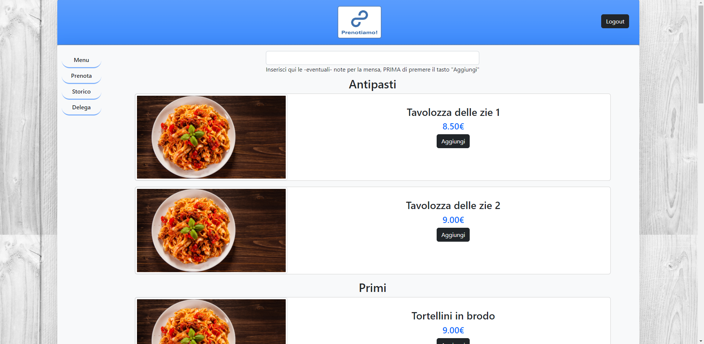
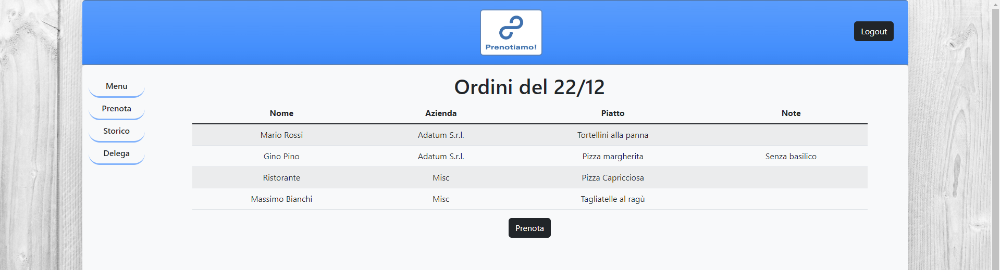
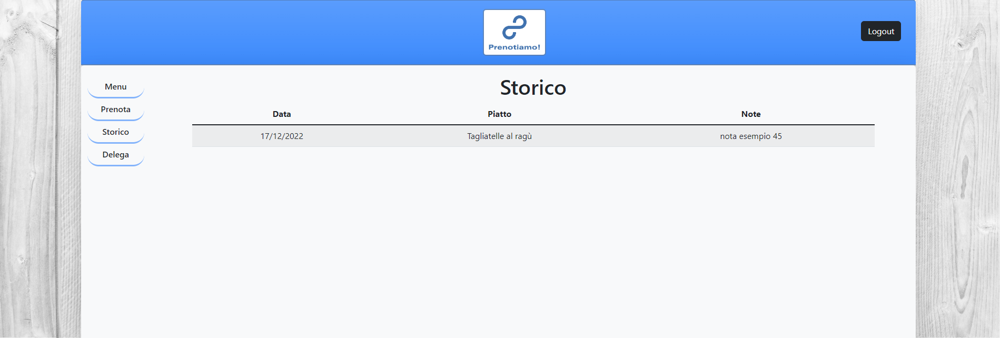
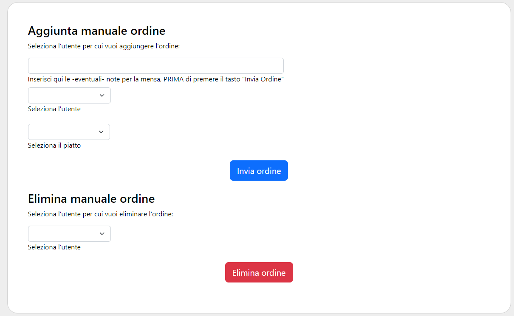

<!-- Improved compatibility of back to top link: See: https://github.com/othneildrew/Best-README-Template/pull/73 -->
<a name="readme-top"></a>
<!--
*** Thanks for checking out the Best-README-Template. If you have a suggestion
*** that would make this better, please fork the repo and create a pull request
*** or simply open an issue with the tag "enhancement".
*** Don't forget to give the project a star!
*** Thanks again! Now go create something AMAZING! :D
-->


<!-- PROJECT LOGO -->
<br />
<div align="center">
  <a href="https://github.com/gerardocipriano/prenotiamo">
    
  </a>

<h3 align="center">Prenotiamo!</h3>

  <p align="center">
    A website that collects food orders and then allow users to forward the list to the restaurant
    <br />
    <a href="https://github.com/gerardocipriano/prenotiamo"><strong>Explore the docs »</strong></a>
    <br />
    <br />
    <a href="https://prenotiamo.tk/">View Demo</a>
    ·
    <a href="https://github.com/gerardocipriano/prenotiamo/issues">Report Bug</a>
    ·
    <a href="https://github.com/gerardocipriano/prenotiamo/issues">Request Feature</a>
  </p>
</div>
</div>


<!-- TABLE OF CONTENTS -->
<details>
  <summary>Table of Contents</summary>
  <ol>
    <li>
      <a href="#about-the-project">About The Project</a>
    </li>
    <li>
      <a href="#getting-started">Getting Started</a>
      <ul>
        <li><a href="#installation">Installation</a></li>
      </ul>
    </li>
    <li><a href="#usage">Usage</a></li>
    <li><a href="#roadmap">Roadmap</a></li>
    <li><a href="#license">License</a></li>
    <li><a href="#contact">Contact</a></li>
  </ol>
</details>


<!-- ABOUT THE PROJECT -->
## About The Project
<br />
<div align="center">
  <a href="https://github.com/gerardocipriano/prenotiamo">
    
  </a>
  <p align="center">
</div>
The goal of the project is to develop a website that collects food orders for lunch.
FOs are placed in a dynamic list. When a user decide to close the orders, It sends the list to the restaurant.
Every users order are stored in a separate list, to keep historical data.


<p align="right">(<a href="#readme-top">back to top</a>)</p>


<!-- GETTING STARTED -->
### Installation

1. Clone the repo
   ```
   git clone https://github.com/gerardocipriano/prenotiamo.git
   ```
2. Fill .envtemplate with your custom variables. Rename it in .env
3. build it:
   ```
   npm i
   npm run dev
   ```

<p align="right">(<a href="#readme-top">back to top</a>)</p>


<!-- USAGE EXAMPLES -->
## Usage
The user guide is written in the language used by the end users. Instructions for other languages will be included in future releases of the project.

La pagina iniziale fornisce alcune informazioni principali sull'uso dell'applicazione. Alcuni concetti verranno ribaditi anche in questa guida.

### Utenti Generici
Se non si è ancora in possesso di un utente, cliccare su Registrati.
Al termine della registrazione o del login, sarà possibile visualizzare i pulsanti Menu, Prenota e Storico.

Dalla pagina Menù è possibile selezionare il piatto che si intende prenotare.
ATTENZIONE! Le note sono da inserire prima di premere sul tasto "Aggiungi".
Se non puoi prenotare, chiedi ad un utente delegato del tuo ufficio di fare l'ordine al posto tuo.


<div align="center">
  <a href="https://github.com/gerardocipriano/prenotiamo">
    
  </a>
</div>

Dalla pagina prenota è possibile visualizzare l'elenco di tutti gli ordini pervenuti nella mattinata.
Se hai scelto un piatto per errore, in corrispondenza del tuo ordine troverai un tasto che ti permettera di eliminarlo. Torna poi in menù per reinserire quello corretto.


<div align="center">
  <a href="https://github.com/gerardocipriano/prenotiamo">
    
  </a>
</div>

Dalla pagina storico puoi vedere tutti gli ordini che hai inviato da quando ti sei registrato.

<div align="center">
  <a href="https://github.com/gerardocipriano/prenotiamo">
    
  </a>
</div>

### Utenti Ordinanti

Da utente Ordinante, ti è possibile visualizzare il tasto per inviare la lista degli ordini presenti nella pagina "Prenota".
Se sei autorizzato ad inviare ordini, oltre ai tasti citati qui sopra, puoi vedere nella barra di navigazione anche il tasto delega.
L'interfaccia ti offre la possibilità, nella prima parte, di inserire un ordine a nome di un altro collega; nella seconda parte puoi eliminare l'ordine di un collega selezionando il suo nome e poi cliccando sul tasto.
Quest'ultima azione è irreversibile.

<div align="center">
  <a href="https://github.com/gerardocipriano/prenotiamo">
    
  </a>
</div>
<p align="right">(<a href="#readme-top">back to top</a>)</p>

### Utente Ristorante

Prenotiamo! mette a disposizione per la mensa un' interfaccia pratica e intuitiva per l'inserimento e/o la rimozione di piatti dal menù.
Nella prima parte puoi inserire il nuovo piatto, inserendo nome, prezzo e tipo di portata (antipasto, primo, secondo o pizza).
Nella seconda parte, puoi rimuovere piatti dal menù. Usare questa funzione solo se si intendere rimuovere <b>definitivamente</b> dal menù il piatto (da non usare  in caso di temporanea mancanza).
La funzionalità Aggiungi immagine è ancora in fase di sviluppo, verrà resa disponibili nelle future versioni dell'applicazione.

<div align="center">
  <a href="https://github.com/gerardocipriano/prenotiamo">
    
  </a>
</div>
<p align="right">(<a href="#readme-top">back to top</a>)</p>

<!-- ROADMAP -->
## Roadmap

Mandatory features:
- [x] Design Mockup
- [x] Build DB & SQL instructions
- [x] Register & Login 
- [x] Write CSS
- [x] Render menù in the "Menù" page
- [x] Users can view their past orders
- [x] Users can close the order
- [x] Users can choose one dish of their choose from the menu
- [x] Assess accesibility
- [x] User Role Management


Optional featues:

- [X] Design Graphics
- [ ] Display username in the top of the page
- [ ] Back to top button
- [ ] Push notification to all logged in users when the order is sent to the restaurant
- [x] Admin user that can add more entries in the menu
- [x] Delegated user that can send the order and make order for other users
- [x] SMTP function using https://nodemailer.com/
- [x] Hosting the webserver on Netlify
- [x] Company entities

<p align="right">(<a href="#readme-top">back to top</a>)</p>


<!-- LICENSE -->
## License

Distributed under the MIT License. See `LICENSE` for more information.

<p align="right">(<a href="#readme-top">back to top</a>)</p>


<!-- CONTACT -->
## Contact

Gerardo Cipriano - gerardo.cipriano@studio.unibo.it <br />

Massimiliano Battelli - massimilian.battelli@studio.unibo.it <br />


Project Link: [https://github.com/gerardocipriano/prenotiamo](https://github.com/gerardocipriano/prenotiamo)

<p align="right">(<a href="#readme-top">back to top</a>)</p>


<!-- MARKDOWN LINKS & IMAGES -->
[license-url]: https://github.com/gerardocipriano/prenotiamoblob/master/LICENSE
[product-screenshot]: src/public/img/secondLogo.jpg
