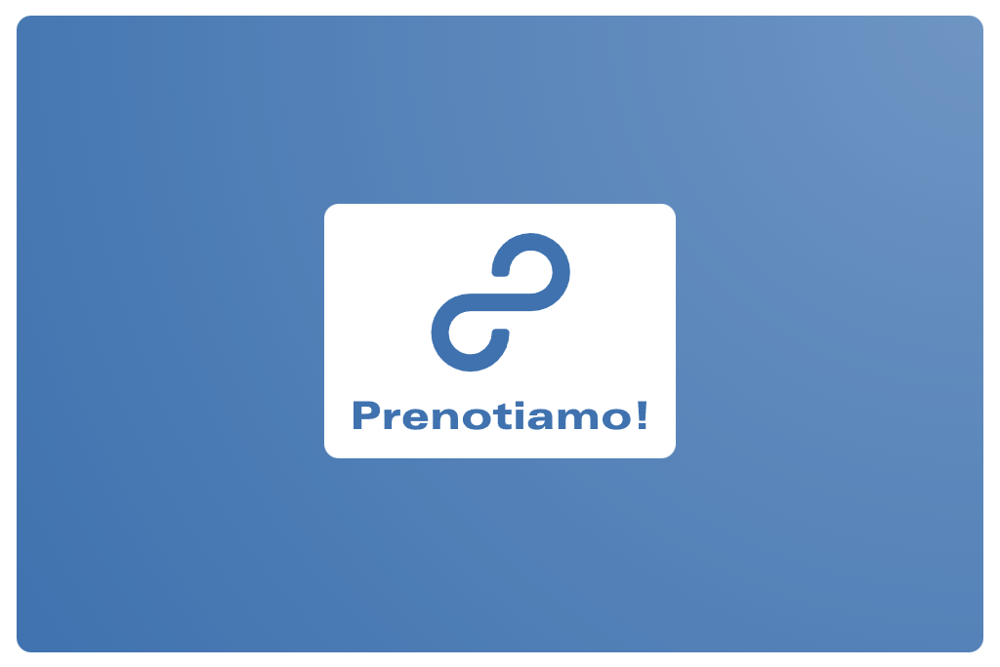

<!-- Improved compatibility of back to top link: See: https://github.com/othneildrew/Best-README-Template/pull/73 -->
<a name="readme-top"></a>
<!--
*** Thanks for checking out the Best-README-Template. If you have a suggestion
*** that would make this better, please fork the repo and create a pull request
*** or simply open an issue with the tag "enhancement".
*** Don't forget to give the project a star!
*** Thanks again! Now go create something AMAZING! :D
-->


<!-- PROJECT LOGO -->
<br />
<div align="center">
  <a href="https://github.com/gerardocipriano/isw">
    
  </a>

<h3 align="center">Prenotiamo!</h3>

  <p align="center">
    A website that collects food orders and then allow users to forward the list to the restaurant
</div>


<!-- TABLE OF CONTENTS -->
<details>
  <summary>Table of Contents</summary>
  <ol>
    <li>
      <a href="#about-the-project">About The Project</a>
    </li>
    <li>
      <a href="#getting-started">Getting Started</a>
      <ul>
        <li><a href="#installation">Installation</a></li>
      </ul>
    </li>
    <li><a href="#usage">Usage</a></li>
    <li><a href="#roadmap">Roadmap</a></li>
    <li><a href="#license">License</a></li>
    <li><a href="#contact">Contact</a></li>
  </ol>
</details>


<!-- ABOUT THE PROJECT -->
## About The Project
<br />
<div align="center">
  <a href="https://github.com/gerardocipriano/isw">
    
  </a>
  <p align="center">
</div>
The goal of the project is to develop a website that collects food orders for lunch.
FOs are placed in a dynamic list. When a user decide to close the orders, It sends the list to the restaurant.
Every users order are stored in a separate list, to keep historical data.


<p align="right">(<a href="#readme-top">back to top</a>)</p>


<!-- GETTING STARTED -->
### Installation

1. Clone the repo
   ```
   git clone https://github.com/gerardocipriano/isw.git
   ```
3. build it:
   ```
   npm i
   npm run dev
   ```
Alternatively you could just download the latest release and run it with
   ```
   
   ```

<p align="right">(<a href="#readme-top">back to top</a>)</p>


<!-- USAGE EXAMPLES -->
## Usage
The usage of the website is quite intuitive and quite similar to others take away web application.
Once accessed to the website, the user is prompted to login.
<div align="center">
  <a href="https://github.com/gerardocipriano/isw">
    
  </a>
</div>
From the "Menù" page, the user can choice from the restaurant menù.
<div align="center">
  <a href="https://github.com/gerardocipriano/isw">
    
  </a>
</div>
DESCRIVI PAGINA STORICO ORDINI UTENTE
<div align="center">
  <a href="https://github.com/gerardocipriano/isw">
    
  </a>
</div>
DESCRIVI PAGINA INVIO ORDINE
<div align="center">
  <a href="https://github.com/gerardocipriano/isw">
    
  </a>
</div>
<p align="right">(<a href="#readme-top">back to top</a>)</p>


<!-- ROADMAP -->
## Roadmap

Mandatory features:
- [ ] Design Mockup
- [ ] Build DB & SQL instruction
- [ ] Register & Login 
- [ ] Render menù in the "Menù" page
- [ ] SMTP function


Optional featues:

- [X] Design Graphics

<p align="right">(<a href="#readme-top">back to top</a>)</p>


<!-- LICENSE -->
## License

Distributed under the MIT License. See `LICENSE` for more information.

<p align="right">(<a href="#readme-top">back to top</a>)</p>


<!-- CONTACT -->
## Contact

Gerardo Cipriano - gerardo.cipriano@studio.unibo.it <br />

Project Link: [https://github.com/gerardocipriano/isw](https://github.com/gerardocipriano/isw)

<p align="right">(<a href="#readme-top">back to top</a>)</p>


<!-- MARKDOWN LINKS & IMAGES -->
[license-url]: https://github.com/gerardocipriano/iswblob/master/LICENSE
[product-screenshot]: images/secondLogo.jpg
