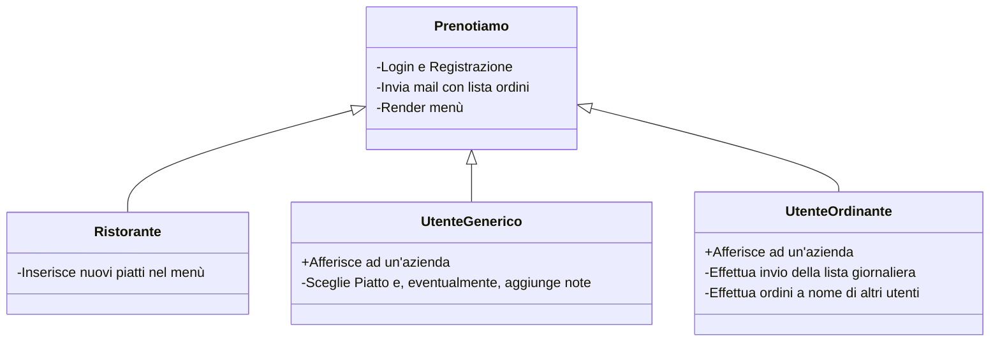

# Meta-relazione per Ingegneria dei Sistemi Web

# Analisi

Il software "Prenotiamo!" è commissionato da un aggregato di aziende nella stessa palazzina, si pone l'obbiettivo di informatizzare il processo di prenotazione pranzo per i rispettivi dipendenti.
Al momento, per ogni azienda, c'è un dipendente che si prende in carico la raccolta delle prenotazioni dagli altri colleghi. Questo processo è un enorme spreco di tempo per il dipendente "ordinante", che deve scrivere o chiamare ciascun collega per raccogliere la rispettiva preferenza.
La mensa è unica e si trova al piano terra dello stabile. La lista degli ordini che arriva in cucina, è composta dalle prenotazione di tutti i dipendenti delle aziende. La convenzione in essere con la mensa, permette ai dipendenti di scegliere una sola portata dal menu.
L'applicazione verrà resa disponibile anche alla mensa, così da ottimizzare i tempi in cucina e rendere i tempi di attesa in sala più corti.

## Requisiti

#### Requisiti funzionali
- La mensa dovrà essere in grado di agginungere nuove portare al menù.
- Gli utenti del sistema possono scegliere dal menù una portata.
- L'utente "ordinante" dovrà essere in grado di chiudere la lista degli ordini. Quando si chiude la lista, 
  l'applicazione invia una mail alla mensa, con l'elenco degli ordini.
- L'utente "ordinante" dovrà essere in grado di effettuare ordine a nome di altri utenti, i quali magari sono impegnati in altre attività.
- Deve essere fornito un sistema di registrazione e di login ai dipendenti

#### Requisiti non funzionali

-   Gli utenti potranno modificare il proprio ordine.
-   Viene inviata una notifica agli utenti loggati nel sistema quando l'ordine viene chiuso, chi non aveva ancora inviato l'ordine, dovrà provvedere a chiamare la   mensa per l'aggiunta manuale del suo piatto.
-  Gli utenti possono vedere lo storico dei loro ordini passati.

## Analisi e modello del dominio

"Prenotiamo!" dovrà interagire con diverse entità: con gli utenti Generici,
con la Mensa, con gli utenti Ordinanti.
La mensa caricherà i piatti nel menù, "Prenotiamo!" deve stamparlo agli utenti.
Gli ordini degli utenti vengono salvati in una lista, gli utenti ordinanti saranno gli unici
a poter inviare tale lista alla cucina.
Nel form di registrazione, i nuovi utenti dovranno selezionare a quale azienda afferiscono.
L'associazione utente -> azienda viene riportata alla mensa che riceve l'ordine, così da preparare il numero di coperti in sala.
Dato il monte ore concordato, probabilmente alcuni requisiti non funzionali  richiesti dal committente, verranno sviluppati in future versioni del prodotto.

Gli elementi costitutivi del problema sono sintetizzati nella seguente figura.

La difficoltà primaria sarà quella di riuscire ad assegnare diversi privilegi (Utente Generico, Utente Ordinante, Ristorante)
partendo da un set comune di utenti.

Il requisito non funzionale riguardante le notifiche push quando si effettua l'invio dell'ordine alla mensa richiede studi 
che non potranno essere effettuati all'interno del monte ore previsto: tale feature probabilmente sarà oggetto
di futuri lavori.

# Design

In questo capitolo si spiegano le strategie messe in campo per
soddisfare i requisiti identificati nell'analisi.

Si parte da una visione architetturale, il cui scopo è informare il
lettore di quale sia il funzionamento dell'applicativo realizzato ad
alto livello. 

## Architettura

Il software sarà realizzato con il metaframework Nuxt (v3).
Sia backend che frontend utilizzeranno Nuxt.
Lo stile verrà implementato con bootstrap. Si seguirà un approccio Mobile-first nelle fasi del suo sviluppo.
La UI verrà disegnata con Balsamiq e sottoposta a feedback del cliente.
I dati dell'applicazione verranno ospitati su un database MySql in cloud.
Avendo il database in cloud, il backend non avrà mai problemi nel reperire i dati dal DB.
Lo schema logico è disponibile nella repository del progetto.
Tutte le variabili sensibili, come indirizzi, hostname e credenziali, sono salvate in un file .env, non caricato su repository pubbliche, per garantire la confidenzialità dei dati trattati.

## Design dei componenti

In questa sezione approfondiremo i singoli componenti creati, le funzioni che erogano e le API che sfruttano.

### Premessa: DB

Il Database è composto da 4 tabelle.
1. User: lista degli utenti (id, nome, company (ref.company), password, email, role)
    - user importa la lista delle aziende autorizzate dalla tabella company,
    - user ha una colonna che indica anche il ruolo che gli utenti avranno all'interno dell'applicazione, sono: Admin, Ristorante, Ordinante e Generico
2. Company: lista delle aziende autorizzate
3. Menu: contiene la lista dei piatti disponibili per la prenotazione, se ne registra il nome, il prezzo e il tipo di portata (Antipasto, primo, secondo, pizza)
4. Daily_order_list: contiene l'insieme degli ordini arrivati. 
    - ogni entry contiene il riferimento all'id dell'utente, al nome del piatto, alla data dell'ordine e all'azienda dell'utente

Prenotiamo! usa due utenti di servizio per interagire con il DB.
Le query di select, vengono eseguite utilizzando un utente che ha solo i permessi di select sulle tabelle.
Le query che richiedono INSERT, UPDATE e DELETE, sono eseguite invece da un altro utente di servizio, admin.
Le credenziali sono conservate nel file .env in allegato all'applicazione.

### App

Contiene il layout dell'applicazione. Background, Header e Navbar sono definiti qui e sono comuni a tutti gli altri 
compomenti.
Non tutti i pulsanti del navbar sono visibili a tutti gli utenti.
Ogni tasto è "protetto" da v-if. I v-if verificano la condizione che l'utente attualmente loggato sia autorizzato a navigare quel componente:
Il tasto "Admin" è visibile solo agli utenti con ruolo di Admin; analogamente "Delega" agli utenti con ruolo "Ordinante" e "Inserimento" agli utenti con ruolo "Ristorante".
Inoltre la maggior parte dei collegamenti non è visibile se non si è loggati nel sistema: Login, Register, / e Termsofservice sono gli unici componenti consultabili senza essere loggati.

### Index

Questo compontente è il più basico di tutti, ci serviva solo una landing page da cui gli utenti potessero poi
navigare verso i form di Login o di Register. Non viene fatto uso di API o di script.

### Login

Form completamente realizzato in bootstrap. Il form di login è usabile solo se l'utente non è già loggato; il
check viene effettuato dal middleware requireLogout.
Il form raccoglie mail e password dell'utente e poi usa un fetch con il metodo POST per inviarli all'API di login.
L'autenticazione è implementata via Json Web Token.
L'API di login verifica che le credenziali usate siano corrette. Se lo sono, restituisce un cookie con 
il token di autenticazione al browser dell'utente.

### Register

Discorso simile al componente di Login. Il form di register è usabile solo se l'utente non è già loggato; il
check viene effettuato dal middleware requireLogout. 
Il form raccoglie nome, mail,  password e azienda (selezionabile in un elenco di aziende autorizzate) dell'utente e poi usa un fetch 
con il metodo POST per inviarli all'API di register.
L'elenco delle aziende viene fetchato dal DB tramite apposita API che esegue una select sul DB.

### Menu

Il componente menù è visibile e accessibile solo dopo il login, il check viene effettuato dal middleware require-login.
Il componente sfrutta una query che interroga il DB, recuperando tramite select tutte le portate registrate nella tabella User.
Le portate vengono stampate in card. Ogni card ha un bottone. Se l'utente ci preme sopra, richiama la funzione sendOrder,
la quale va a registrare la portata scelta all'interno della tabella degli ordini (daily_order_list).

### Prenota

Il componente prenota è visibile e accessibile solo dopo il login, il check viene effettuato dal middleware require-login.
Questa pagina contiene una tabella popolata dalle entry della table daily_order_list.
L' API fa una query richiedendo solo gli ordini del giorno.
Alla fine della tabella, c'è un bottone che chiama la funzione sendMail().
La funzione sendMail() invia all'API /prenota/mail tramite post l'elenco degli ordini.
L'API è realizzata con nodemail. Compone il testo del messaggio diretto al ristorante utilizzando il body della richiesta.
La funzione sendMail è utilizzabile solo da utenti con ruolo "Ordinante", viene eseguito un check per verificare il ruolo
dalla funzione requireOrdinante (contenuta nell'API utils/auth).

#### Invio mail tramite Nodemailer

Il componente Prenota rende disponibile la feature di invio ordine alla mensa. L'invio dell'ordine è effettuato tramite mail.
Si è scelto di implementare la libreria Nodemailer all'interno del progetto. 
Per prima cosa si è installato il pacchetto con i types per typescript.
All'interno di server/utils è presente l'inizializzazione del transport.
Il transport contiene le informazioni riguardo l'indirizzo dell'smtp server al quale inoltrare la mail, la porta e le credenziali.
La tabella degli ordini viene passata (POST) all'API server/api/prenota/mail.
 1. Qui si verifica che la connessione con i parametri impostati in utils vada a buon fine;
 2. Si compone il corpo html della mail, la tabella viene creata dinamicamente, sulla base del corpo ricevuto via POST;
 3. Composti tutti i campi della mail, questa viene inviata usando il transport.
Ho utilizzato il servizio di Fake Inbox offerto da mailtrap.io per eseguire tutti i test in fase di sviluppo. 

### Delega

Il componente delega è visibile e accessibile solo dopo il login, il check viene effettuato dal middleware require-login.
Sul componente viene effettuato un ulteriore controllo: solo gli utenti con il ruolo "Ordinante" possono vedere il tasto nella navbar o
navigare il componente (il double check viene effettuato dal middleware require-ordinante).
La pagina offre due form
 1. Il primo consente l'aggiunta manuale di un ordine a nome di un altro utente già registrato nel sistema.
    Vengono offerte due select, nella prima si seleziona l'utente, nella seconda il piatto da ordinare.
    La prima select viene realizzata da un API /delega/user che restituisce id e nome degli utenti registrati nel sistema.
    Questa API è utilizzabile solo da utenti con il ruolo di "Ordinante".
2. Il secondo form consente l'eliminazione di un ordine creato per errore.
   Offre la selezione di tutti gli utenti registrati nel sistema. La funzione che viene attivata premendo il bottone richiama un'API che prende in ingresso
   l'id dell'utente selezionato e esegue una query di DELETE usando come parametro ID utente e data odierna.

### Admin

Non richiesto dal cliente ma implementato comunque per garantire una gestibilità maggiore dell'applicazione. Il componente Admin è visibile e accessibile solo dopo il login, il check viene effettuato dal middleware require-login.
Sul componente viene effettuato un ulteriore controllo: solo gli utenti con il ruolo "Admin" possono vedere il tasto nella navbar o
navigare il componente (il double check viene effettuato dal middleware require-admin).
La pagina offre la possibilità ad un amministratore di sistema, di configurare agevolmente i ruoli degli utenti registrati.
Un API apposita recupera la lista degli utenti, che vengono mostrati in una select.
In un' altra select si sceglie il nuovo ruolo dell'utente.
La funzione richiamata alla pressione del bottone, passa alla query l'id dell'utente scelto e il nuovo ruolo.
L'API effettua una query di UPDATE.

### Inserimento

Il componente Inserimento è visibile e accessibile solo dopo il login, il check viene effettuato dal middleware require-login.
Sul componente viene effettuato un ulteriore controllo: solo gli utenti con il ruolo "ristorante" possono vedere il tasto nella navbar o
navigare il componente (il double check viene effettuato dal middleware require-ristorante).
Viene offerta un interfaccia per eliminare o aggiungere nuove portate sulla tabella menu.

### Storico

Ogni utente può visualizzare il proprio storico delle prenotazioni fatte nei giorni precedenti. In aggiunta l'untente Ristorante può visualizzare
tutte le prenotazioni fatte, e per ogni utente le proprie prenotazioni.

# Sviluppo

## Testing automatizzato

Il testing avviene continuamente attraverso il comando npm run dev.
Anche dopo il commit, si verifica che la versione demo live su netlify riesca a compilare correttamente e a 
visualizzare le nuove features.

## Note di sviluppo

Per mancanza di tempo, alcuni requisiti non funzionali non sono stati implementati in questa versione del software.
Il codice HTML è stato correttamente validato attraverso l'estensione SiteImprove Site Checker.

# Commenti finali

Tutti i requisiti funzionali richiesti dal committente sono stati implementati e da test funzionano correttamente.
Il tempo di sviluppo ha richiesto molto più tempo di quanto preventivato.
Ci siamo concentrati sull'offrire il maggior numero di funzionalità richieste dagli utenti, tralasciando qualche elemento di stile o di coerenza.
Il risultato finale rispecchia quello che era il nostro obbiettivo iniziale.

# Guida utente

See README.md

